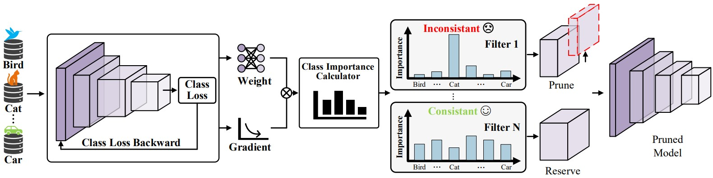
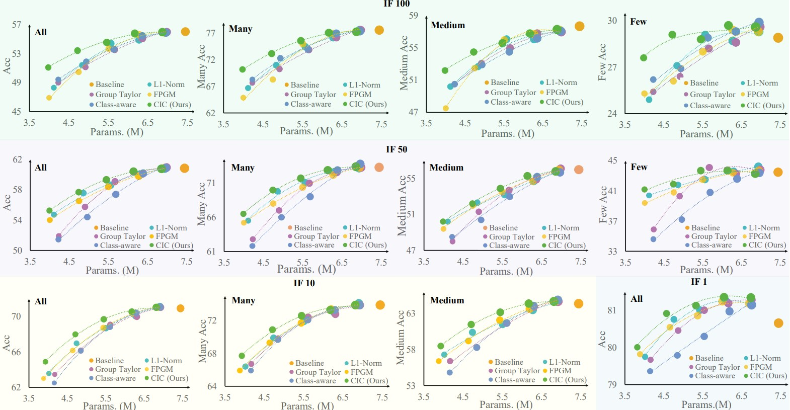

# Class Importance Consistency Matters: Efficient Model Pruning for Long-tailed Recognition Models
<div align="center">
</img>
</div>

## Introduction


This work presents *CIC*, an efficient structrual pruning method for long-tailed recognition models. 

## Experimental Results

The pruning results on CIFAR100-LT (IF=100,50,10 and 1)

<div align="center">
</img>
</div>


## - Requirements
*    Python 3.8
*    Pytorch 1.10.2 py3.6_cuda11.3_cudnn8.2.2.0_0
*    tqdm 4.59.0
*    scikit-learn 0.24.2
*    tensorboard 2.4.1
*    matplotlib 3.3.4
*    torch-pruning 1.3.6

## Dataset
CIFAR100 and ImageNet are necessary for our dataloader to generate CIFAR100-LT and ImageNet-LT \
The directory structure of our dataset are as follows: 

```
CIC_pruning
 └─data
   ├─cifar-100-python   
   └─imagenet
       ├─ train
       │  ├─ n01440764
       |  |  ├─ n01440764_18.JPEG
       |  |  └─ ......
       │  └─ ......
       └─ val
           ├─ n01440764
           |  ├─ ILSVRC2012_val_00000293.JPEG
           |  └─ ......
           └─ ......
```


## Model Zoo

We provide pretrained models on CIFAR100-LT and ImageNet-LT, and example models pruned with our CIC pruning.


| Name            | Acc  | Param (M) | MACs (G) | url |
|-----------------|------|-----------|----------| --- |
| CIFAR100-IF100  | 56.0 | 7.45      | 1.10     |[model](https://github.com/VainF/Diff-Pruning/releases/download/v0.0.1/ddpm_ema_cifar10.zip) |
| CIC (40%)       | 53.4 | 4.72      | 0.64     | [model](https://dl.fbaipublicfiles.com/deit/deit_small_patch16_224-cd65a155.pth) |
| CIFAR100-IF50   | 60.8 | 7.45      | 1.10     | [model](https://dl.fbaipublicfiles.com/deit/deit_base_patch16_224-b5f2ef4d.pth) |
| CIC (40%)       | 55.6 | 4.36      | 0.76     | [model](https://dl.fbaipublicfiles.com/deit/deit_tiny_distilled_patch16_224-b40b3cf7.pth) |
| CIFAR100-IF10   | 71.0 | 7.45      | 1.10     | [model](https://dl.fbaipublicfiles.com/deit/deit_small_distilled_patch16_224-649709d9.pth) |
| CIC (40%)       | 68.0 | 4.71      | 0.63     |[model](https://github.com/VainF/Diff-Pruning/releases/download/v0.0.1/ddpm_ema_cifar10.zip) |
| ImageNet-LT     | 58.2 | 25.02     | 5.58     |[model](https://github.com/VainF/Diff-Pruning/releases/download/v0.0.1/ddpm_ema_cifar10.zip) |
| CIC (40%)       | 56.8 | 19.62     | 3.31     |[model](https://github.com/VainF/Diff-Pruning/releases/download/v0.0.1/ddpm_ema_cifar10.zip) |


### 1. CIFAR100-LT Pruning and Finetuning
We use argument "imb-factor" to control the imbalance factor of CIFAR100 dataset, value=1/IF.
```
python prune.py \
  --dataset cifar100 --arch resnet32 --imb-factor 0.01 \
  --data ./data --pretrained [path/to/pretrained-model] \
  --imp cic --pr 0.3  --global --coef 1.0 \
  --epochs 100 --schedule 60 85 --learning-rate 0.005 \
  --batch-size 128 --cic_batch 128 --workers 32  \
  --mark CIFAR100_cic_IF100_PR30_global
```

### 2. ImageNet-LT Pruning and Finetuning

``` 
python prune.py \
--dataset imagenet --arch resnext50_32x4d --data ./data/imagenet/ --aug randcls \
--pretrained [path/to/pretrained-model] \
--imp cic --pr 0.3 --global --coef 1.0 \
--epochs 50 --schedule 30 42 --learning-rate 0.005 \
--batch-size 128 --cic_batch 128 --workers 32 --val-freq 2 --print-freq 50 \
--mark X50_32x4d_randcls_cic_PR30_global \
--num_classes 1000 \
```


